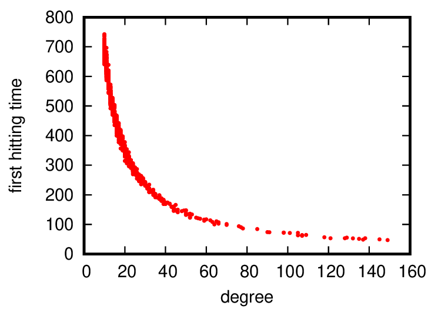
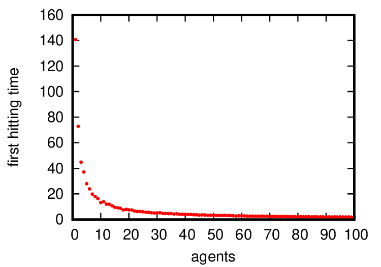

# Parameters
- $G$: [リンクリスト](https://ist.ksc.kwansei.ac.jp/~sakumoto/lecture/ada/file/08_linklist.txt)
- $n$: 1000
- $a$: 1
- $b$: 2, 100, 1000
- $n_a$: 10
- $T$: 1000

# Results
1. $b$ = 2 のとき

   $d_b$: 145
   
   $\hat{\mu}_{a:b}$: 14.411

2. $b$ = 100 のとき

   $d_b$: 29
   
   $\hat{\mu}_{a:b}$: 72.174

3. $b$ = 1000 のとき

   $d_b$: 10
   
   $\hat{\mu}_{a:b}$: 211.241

# Discusssion
これら結果から、重み付き次数 $d_b$ が高いほど $\hat{\mu}_{a:b}$ は小さくなることがわかる。

逆に、重み付き次数 $d_b$ が低いほど $\hat{\mu}_{a:b}$ は小さくなる。

# Appendix
<!--  -->

- $G$: [リンクリスト](https://ist.ksc.kwansei.ac.jp/~sakumoto/lecture/ada/file/08_linklist.txt)
- $n$: 1000
- $a$: 1
- $b$: 2 ~ 1000
- $n_a$: 3
- $T$: 1000

横軸: 重み付き次数 $d_b$

縦軸: $\hat{\mu}_{a:b}$

---

<!--  -->

- $G$: [リンクリスト](https://ist.ksc.kwansei.ac.jp/~sakumoto/lecture/ada/file/08_linklist.txt)
- $n$: 1000
- $a$: 1
- $b$: 2
- $n_a$: 1 ~ 100
- $T$: 1000

横軸: エージェント数 $n_a$

縦軸: $\hat{\mu}_{a:b}$
